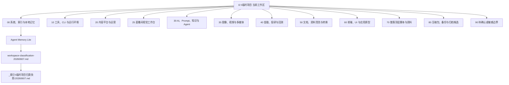

# Current Memory Canvas

更新时间：2026-06-07

```mermaid
flowchart TD
  A["E:\\临时项目 当前工作区"] --> B["00 系统、索引与本地记忆"]
  A --> C["10 工具、CLI 与运行环境"]
  A --> D["20 内容平台与运营"]
  A --> E["25 直播间视觉工作台"]
  A --> F["30 AI、Prompt、知识与 Agent"]
  A --> G["35 图像、视频与多媒体"]
  A --> H["40 金融、投研与回测"]
  A --> I["50 文档、资料清洗与转换"]
  A --> J["60 前端、UI 与应用原型"]
  A --> K["70 散落顶层脚本与资料"]
  A --> L["80 压缩包、备份与归档候选"]
  A --> M["90 待确认或敏感边界"]
  B --> N["Agent Memory Lite"]
  N --> O["workspace-classification-20260607.md"]
  O --> P["_索引\\临时项目归类快照-20260607.md"]
```

## 当前状态

- 已完成 2026-06-07 当前归类快照。
- 分类只记录视图，不移动、不删除任何目录。
- 人工入口在 `_索引\临时项目归类快照-20260607.md`。
- Agent 检索入口在 `scenes\workspace-classification-20260607.md`。
