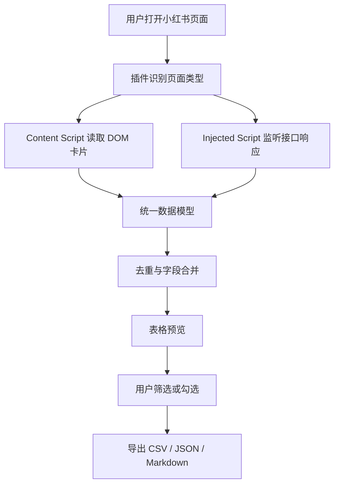

# 小红书笔记导出插件立项书

## 1. 项目名称

小红书笔记导出助手

## 2. 项目背景

内容运营、直播运营、商家和 MCN 团队在分析小红书账号、竞品账号、达人内容和投放素材时，经常需要批量整理笔记标题、正文、互动数据、发布时间、标签和图片链接。

目前人工复制效率低，网页公开分享链接通常只能获取首屏标题，笔记正文、真实笔记 ID 和完整互动数据往往需要在登录后的浏览器环境中由前端接口返回。因此，有必要开发一个运行在用户浏览器中的 Chrome 插件，在用户已登录并可正常访问小红书页面的前提下，辅助用户导出当前可见或可访问的笔记数据。

本项目不以绕过登录、验证码、权限校验或平台风控为目标，只面向用户当前账号可见数据进行本地化导出。

## 3. 项目目标

开发一款 Chrome 浏览器插件，支持在小红书网页版中识别用户主页、搜索结果页、笔记详情页等页面，采集用户当前可见的笔记数据，并导出为 CSV、JSON、Markdown 等格式。

一期目标：

- 支持用户主页笔记列表采集。
- 支持自动滚动加载更多笔记。
- 支持获取笔记标题、作者、用户 ID、笔记类型、点赞数、封面图链接。
- 支持在用户打开笔记详情后采集正文、发布时间、标签、图片链接等详情字段。
- 支持表格预览、勾选、筛选、排序和导出。
- 所有数据默认在本地处理，不上传服务器。

## 4. 目标用户

- 内容运营：批量整理账号内容，用于复盘和选题分析。
- 直播运营：整理直播间搭建、设备、脚本、场景相关笔记。
- 商家团队：采集竞品内容、达人素材和商品种草案例。
- MCN / 代运营团队：沉淀账号内容库和达人内容库。
- 研究人员：对公开可见内容进行结构化整理。

## 5. 使用场景

### 5.1 账号主页导出

用户打开某个小红书账号主页，插件识别页面上的笔记列表，用户点击“一键下载”后，插件自动滚动加载并整理笔记卡片数据。

### 5.2 笔记详情导出

用户打开某篇笔记详情页，插件读取当前页面或前端接口返回的详情数据，导出正文、标签、图片链接、发布时间等信息。

### 5.3 批量整理竞品内容

用户进入竞品账号主页，按点赞数、类型、关键词筛选笔记，然后导出 CSV，用于 Excel 或数据分析工具进一步处理。

### 5.4 运营素材归档

用户将导出的笔记正文和图片链接转成 Markdown，用于内部知识库、Notion、飞书文档或本地文件归档。

## 6. 功能范围

### 6.1 一期功能

| 模块 | 功能 | 说明 |
| --- | --- | --- |
| 页面识别 | 识别用户主页、搜索页、详情页 | 根据 URL、DOM 和接口特征判断页面类型 |
| 数据采集 | 采集笔记列表数据 | 标题、作者、用户 ID、点赞数、类型、封面图 |
| 详情采集 | 采集笔记详情数据 | 正文、发布时间、标签、图片列表 |
| 自动加载 | 自动滚动加载更多 | 支持设置最大采集数量 |
| 数据预览 | 表格展示采集结果 | 支持选择、排序、筛选 |
| 数据导出 | 导出 CSV、JSON、Markdown | CSV 适合表格，Markdown 适合知识库 |
| 本地缓存 | 临时保存采集结果 | 避免刷新后丢失 |
| 状态提示 | 展示采集进度和失败原因 | 例如需要登录、接口无权限、加载结束 |

### 6.2 二期功能

- 支持搜索结果页批量导出。
- 支持收藏页、点赞页、专辑页导出。
- 支持图片下载。
- 支持将每篇笔记导出为单独 Markdown 文件。
- 支持断点续采。
- 支持字段自定义。
- 支持导出 Excel。
- 支持简单数据分析，例如高赞词频、标签统计、笔记类型占比。

### 6.3 暂不支持

- 不支持绕过登录限制。
- 不支持破解验证码。
- 不支持采集用户无权访问的内容。
- 不支持采集私密笔记。
- 不默认上传数据到云端。
- 不提供批量轰炸式接口请求。

## 7. 数据字段设计

### 7.1 列表字段

| 字段 | 字段名 | 类型 | 说明 |
| --- | --- | --- | --- |
| 序号 | index | number | 当前采集顺序 |
| 用户标识 | user_id | string | 作者用户 ID |
| 用户昵称 | nickname | string | 作者昵称 |
| 标题 | title | string | 笔记标题 |
| 笔记类型 | type | string | 图文 / 视频 |
| 点赞数 | liked_count | number/string | 页面返回的点赞数 |
| 封面图 | cover_url | string | 封面图片链接 |
| 笔记 ID | note_id | string | 如接口返回则保存 |
| xsec_token | xsec_token | string | 小红书页面跳转参数，如接口返回则保存 |
| 来源页面 | source_url | string | 采集时所在页面 |

### 7.2 详情字段

| 字段 | 字段名 | 类型 | 说明 |
| --- | --- | --- | --- |
| 正文 | content | string | 笔记正文 |
| 标签 | tags | array | 话题标签 |
| 发布时间 | publish_time | string/number | 页面或接口返回时间 |
| 更新时间 | update_time | string/number | 如有 |
| 图片列表 | image_urls | array | 笔记图片链接 |
| 视频链接 | video_url | string | 如有 |
| 评论数 | comment_count | number/string | 如接口返回 |
| 收藏数 | collect_count | number/string | 如接口返回 |
| 分享数 | share_count | number/string | 如接口返回 |

## 8. 技术方案

### 8.1 技术栈

- Chrome Extension Manifest V3
- TypeScript
- Vite
- React 或 Vue
- IndexedDB / chrome.storage.local
- PapaParse 或自研 CSV 导出
- JSZip，可选，用于多文件打包

### 8.2 插件结构

```text
xhs-exporter-extension/
  manifest.json
  src/
    background/
      service-worker.ts
    content/
      content-script.ts
      page-detector.ts
      dom-collector.ts
    injected/
      network-hook.ts
    popup/
      Popup.tsx
    sidepanel/
      SidePanel.tsx
    shared/
      types.ts
      exporter.ts
      storage.ts
      sanitizer.ts
      rate-limit.ts
```

### 8.3 核心模块

#### Content Script

负责运行在小红书页面中：

- 判断当前页面类型。
- 读取 DOM 中已有笔记卡片。
- 控制页面滚动加载。
- 接收 injected script 捕获的数据。
- 将数据发送到插件后台或侧边栏。

#### Injected Script

负责注入到页面上下文中：

- Hook `window.fetch`。
- Hook `XMLHttpRequest`。
- 监听小红书前端接口响应。
- 将接口响应通过 `window.postMessage` 传给 content script。

说明：部分网页前端接口返回的数据不会直接出现在 DOM 中，只能通过页面运行时接口响应获取。插件需要在用户浏览器内捕获这些响应。

#### Service Worker

负责插件后台能力：

- 消息转发。
- 文件导出。
- 数据缓存。
- 权限和状态管理。

#### Popup / Side Panel

负责用户界面：

- 显示已采集数据。
- 提供筛选、排序、勾选。
- 提供导出 CSV / JSON / Markdown 按钮。
- 显示采集进度和错误提示。

### 8.4 数据采集流程



### 8.5 去重策略

优先级：

1. `note_id`
2. `note_id + xsec_token`
3. `title + author_id + cover_url`
4. `title + author_id + index`

当详情数据和列表数据重复时，以详情数据补全列表数据，不覆盖已有的有效字段。

## 9. 权限设计

`manifest.json` 权限建议：

```json
{
  "manifest_version": 3,
  "name": "小红书笔记导出助手",
  "version": "0.1.0",
  "permissions": [
    "storage",
    "downloads",
    "activeTab",
    "scripting"
  ],
  "host_permissions": [
    "https://www.xiaohongshu.com/*",
    "https://edith.xiaohongshu.com/*"
  ]
}
```

权限原则：

- 只申请小红书相关域名权限。
- 不读取无关网站。
- 不读取用户密码、Cookie、手机号。
- 不上传用户数据。
- 导出操作由用户主动触发。

## 10. 合规与隐私原则

本项目必须遵守以下原则：

- 只处理用户当前账号有权访问的数据。
- 不绕过登录、验证码、权限校验和平台风控。
- 不采集用户 Cookie、密码、短信验证码等敏感信息。
- 默认本地处理和本地导出。
- 如未来加入云端同步，必须单独征得用户授权。
- 插件页面明确展示隐私说明。
- 用户可一键清空本地缓存。
- 导出的数据由用户自行承担后续使用责任。

## 11. 风控策略

为了降低账号和页面访问风险，一期应加入以下限制：

- 自动滚动间隔：1.5 秒到 3 秒随机。
- 单次最大采集数量：默认 100 条，可配置。
- 详情采集间隔：3 秒到 8 秒随机。
- 失败重试次数：最多 2 次。
- 遇到登录弹窗、验证码、访问异常时立即停止。
- 不并发批量请求详情接口。
- 不在后台静默采集，必须由用户主动点击开始。

## 12. MVP 范围

MVP 只验证最关键链路：

1. 用户打开小红书账号主页。
2. 插件识别页面。
3. 插件抓取前 10 条笔记列表。
4. 用户打开笔记详情后，插件能补全正文。
5. 插件展示表格。
6. 插件导出 CSV。

MVP 不做：

- 多账号管理。
- 云端同步。
- 图片批量下载。
- 高级数据分析。
- 自动登录。

## 13. 项目排期

### 第 1 周：技术验证

目标：验证数据能否稳定采集。

任务：

- 搭建 Chrome Extension MV3 项目。
- 实现 content script 注入。
- 实现页面类型识别。
- 实现 DOM 卡片采集。
- 实现 fetch / XHR hook。
- 验证用户主页列表接口返回。
- 验证笔记详情接口返回。
- 输出技术验证报告。

交付物：

- 可安装 Demo 插件。
- 能导出 JSON 的最小版本。
- 接口字段样例。

### 第 2 周：MVP 产品化

目标：做成可使用工具。

任务：

- 开发表格弹窗或侧边栏。
- 支持勾选、排序、筛选。
- 支持 CSV 导出。
- 支持 JSON 导出。
- 支持自动滚动加载。
- 支持进度提示。
- 支持错误提示。

交付物：

- MVP 插件包。
- 使用说明。
- 测试账号页面样例。

### 第 3 周：稳定性与合规

目标：降低误用和失败率。

任务：

- 加入采集限速。
- 加入去重和字段合并。
- 加入本地缓存清理。
- 完善隐私说明。
- 完善异常处理。
- 编写手动测试用例。
- 准备 Chrome Web Store 上架材料。

交付物：

- Beta 插件包。
- 隐私政策文案。
- 测试报告。
- 上架素材草稿。

## 14. 验收标准

### MVP 验收

- 能在用户已登录的小红书主页运行。
- 能采集不少于 10 条笔记列表数据。
- 能导出 CSV 文件。
- CSV 中文、表情符号不乱码。
- 能识别登录弹窗或访问失败。
- 不上传任何用户数据。

### Beta 验收

- 能连续采集 100 条以内笔记列表。
- 重复采集不会产生大量重复数据。
- 至少支持 CSV、JSON 两种格式。
- 详情页正文采集成功率达到可接受水平。
- 遇到风控、验证码、登录失效时能停止并提示。
- 插件权限符合最小化原则。

## 15. 主要风险

| 风险 | 影响 | 应对 |
| --- | --- | --- |
| 小红书接口变化 | 采集失效 | 抽象数据适配层，减少硬编码 |
| 页面结构变化 | DOM 采集失效 | DOM 和接口双通道采集 |
| 登录态限制 | 无法采集正文 | 明确要求用户在浏览器内登录 |
| 风控触发 | 页面要求验证 | 限速、停止重试、不并发 |
| 上架审核 | 插件被拒 | 权限最小化，提供隐私政策 |
| 数据滥用 | 合规风险 | 本地处理，用户主动导出，明确使用边界 |

## 16. 竞品与参考

截图中的插件形态可以作为一期交互参考：

- 页面右上角提供“一键下载”入口。
- 弹窗内展示笔记列表表格。
- 支持按时间或序号分页。
- 支持筛选、清空、全部下载、下载 CSV。

本项目可以在此基础上增加：

- 正文采集状态。
- 字段完整度提示。
- Markdown 导出。
- 自动滚动进度。
- 本地缓存管理。

## 17. 成本预估

### 人力

- 前端 / 插件开发：1 人，3 周。
- 测试：0.5 人，1 周。
- 产品 / 运营文档：0.5 人，3 到 5 天。

### 技术成本

一期不需要服务器。

如后续需要云端同步、团队协作、账号管理或数据分析，则需要增加：

- 后端 API
- 数据库
- 用户系统
- 云存储
- 隐私合规审核

## 18. 立项结论

本项目具备明确的运营工具价值，技术上建议优先以 Chrome 插件形式实现。插件运行在用户已登录浏览器环境中，可以比普通爬虫更稳定地获取用户当前可见数据，同时避免要求用户提供 Cookie 或账号密码。

建议先投入 3 周完成 MVP 和 Beta 验证。若 Beta 阶段能稳定导出用户主页列表和笔记详情正文，再评估是否继续开发图片下载、批量 Markdown、团队版和数据分析功能。

